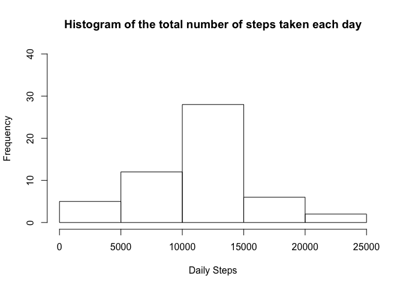
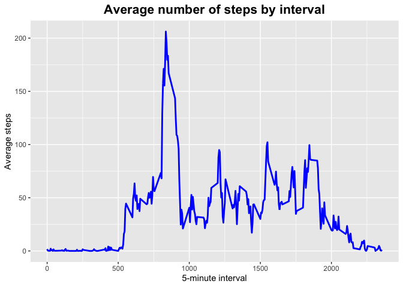
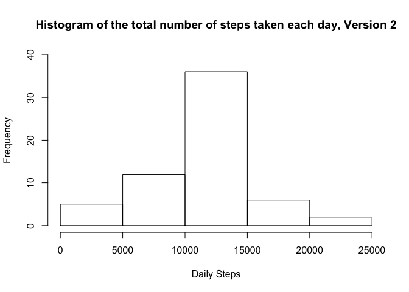
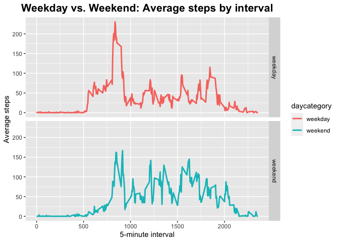

## Loading and preprocessing the data

Show any code that is needed to

#### 1. Load the data (i.e. `read.csv()`)


```r
library(dplyr)
```

```
## 
## Attaching package: 'dplyr'
```

```
## The following objects are masked from 'package:stats':
## 
##     filter, lag
```

```
## The following objects are masked from 'package:base':
## 
##     intersect, setdiff, setequal, union
```

```r
library(ggplot2)
library(tidyr)
library(lubridate)
```

```
## 
## Attaching package: 'lubridate'
```

```
## The following objects are masked from 'package:dplyr':
## 
##     intersect, setdiff, union
```

```
## The following objects are masked from 'package:base':
## 
##     date, intersect, setdiff, union
```

```r
library(chron)
```

```
## 
## Attaching package: 'chron'
```

```
## The following objects are masked from 'package:lubridate':
## 
##     days, hours, minutes, seconds, years
```

```r
activity_full <- read.csv("activity.csv", stringsAsFactors = FALSE, header = TRUE)
```

#### 2. Process/transform the data (if necessary) into a format suitable for your analysis

```r
## Data framte with NA rows
steps_NA <- activity_full[is.na(activity_full$steps),]

## Data frame without NA rows
activity_ok <- activity_full[!is.na(activity_full$steps),]
```

****************************************************************************************************  
## What is mean total number of steps taken per day?
For this part of the assignment, you can ignore the missing values in
the dataset.

#### 1. Make a histogram of the total number of steps taken each day


```r
daily_steps <- activity_ok %>%
        group_by(date) %>%
        summarize(steps_sum = sum(steps))
```


```r
hist(daily_steps$steps_sum, main="Histogram of the total number of steps taken each day", 
     xlab="Daily Steps", ylim = c(0, 40))
```

<!-- -->

#### 2. Calculate and report the **mean** and **median** total number of steps taken per day


```r
daily_mean <- mean(daily_steps$steps_sum)
daily_median <- median(daily_steps$steps_sum)
```

Mean of daily steps:

```
## [1] "The mean of daily steps is: 10766.19"
```
Median of daily steps:

```
## [1] "The median of daily steps is: 10765"
```

****************************************************************************************************  
## What is the average daily activity pattern?
#### 1. Make a time series plot (i.e. `type = "l"`) of the 5-minute interval (x-axis) and the average number of steps taken, averaged across all days (y-axis)

```r
  data_by_interval <- activity_ok %>%
    group_by(interval) %>%
    summarize(avg_steps = mean(steps))
```


```r
interval_plot <- ggplot(data=data_by_interval, aes(x=interval, y=avg_steps)) +
        ggtitle("Average number of steps by interval") +
        theme(plot.title = element_text(hjust = 0.5, size = 16, face = "bold")) +
        geom_line(colour="blue", size=1) + 
        labs(x="5-minute interval", y="Average steps")
interval_plot
```

<!-- -->

#### 2. Which 5-minute interval, on average across all the days in the dataset, contains the maximum number of steps?

```r
id_max_interval <- which.max(data_by_interval$avg_steps)
```


```
## [1] "The 5-minute interval with the maximum number of steps is: 835"
```

****************************************************************************************************  
## Imputing missing values
Note that there are a number of days/intervals where there are missing
values (coded as `NA`). The presence of missing days may introduce
bias into some calculations or summaries of the data.

#### 1. Calculate and report the total number of missing values in the dataset (i.e. the total number of rows with `NA`s)

```r
## Observations with NA put in a data frame steps_NA at the beginning of this assignment
nrow(steps_NA)
```

```
## [1] 2304
```


#### 2. Devise a strategy for filling in all of the missing values in the dataset. The strategy does not need to be sophisticated. For example, you could use the mean/median for that day, or the mean for that 5-minute interval, etc.


```r
## Strategy: fill in the mean of steps by interval
mean_steps_by_interval <- with(activity_ok, tapply(steps, activity_ok$interval, mean))
steps_NA$steps <- mean_steps_by_interval
```

#### 3. Create a new dataset that is equal to the original dataset but with the missing data filled in.

```r
activity_new <- rbind(activity_ok, steps_NA)
activity_new_ordered <- activity_new[order(activity_new$date),]
```

#### 4. Make a histogram of the total number of steps taken each day and Calculate and report the **mean** and **median** total number of steps taken per day. Do these values differ from the estimates from the first part of the assignment? What is the impact of imputing missing data on the estimates of the total daily number of steps?

```r
daily_steps_2 <- activity_new_ordered %>%
        group_by(date) %>%
        summarize(steps_sum = sum(steps))
```


```r
hist(daily_steps_2$steps_sum, main="Histogram of the total number of steps taken each day, Version 2", 
     xlab="Daily Steps", ylim = c(0, 40))
```

<!-- -->


```r
daily_mean_2 <- mean(daily_steps_2$steps_sum)
daily_median_2 <- median(daily_steps_2$steps_sum)
```

Mean of daily steps:

```
## [1] "The mean of daily steps is: 10766.19"
```
Median of daily steps:

```
## [1] "The median of daily steps is: 10766.1886792453 2"
```

The median has changed compared to the first task. The median is still the same.    

****************************************************************************************************  

## Are there differences in activity patterns between weekdays and weekends?
For this part the `weekdays()` function may be of some help here. Use
the dataset with the filled-in missing values for this part.

#### 1. Create a new factor variable in the dataset with two levels -- "weekday" and "weekend" indicating whether a given date is a weekday or weekend day.


```r
## As system language is not English, changing language first to get Weekdays in EN
curr_locale <- Sys.getlocale("LC_TIME")
Sys.setlocale("LC_TIME","en_US.UTF-8")
```

```
## [1] "en_US.UTF-8"
```

```r
activity_new_ordered['day'] <- weekdays(as.Date(activity_new_ordered$date))

## Categorization in Weekday or Weekend
activity_new_ordered$daycategory <- ifelse(activity_new_ordered$day %in% c("Saturday", "Sunday"), "weekend", "weekday")
```

#### 2. Make a panel plot containing a time series plot (i.e. `type = "l"`) of the 5-minute interval (x-axis) and the average number of steps taken, averaged across all weekday days or weekend days (y-axis).


```r
  weekday_interval <- activity_new_ordered %>%
    group_by(interval, daycategory) %>%
    summarize(avg_steps = mean(steps))
```


```r
weekday_plot <- ggplot(weekday_interval, aes(x=interval, y=avg_steps, col=daycategory)) +
        ggtitle("Weekday vs. Weekend: Average steps by interval") +
        theme(plot.title = element_text(hjust = 0.5, size = 16, face = "bold")) +
        facet_grid(daycategory ~ .) +
        geom_line(size=1) + 
        labs(x="5-minute interval", y="Average steps")
weekday_plot
```

<!-- -->

